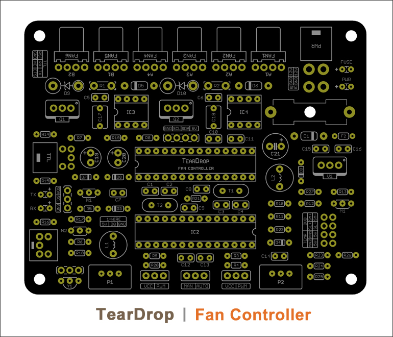
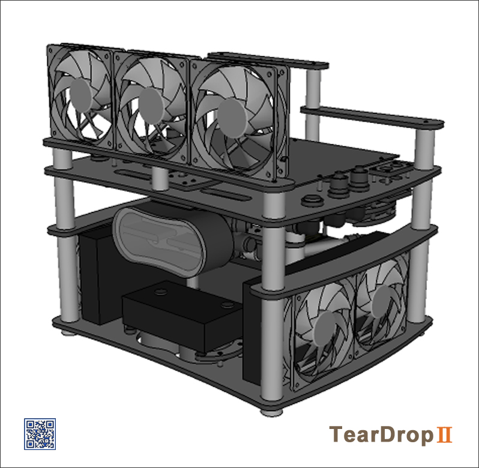
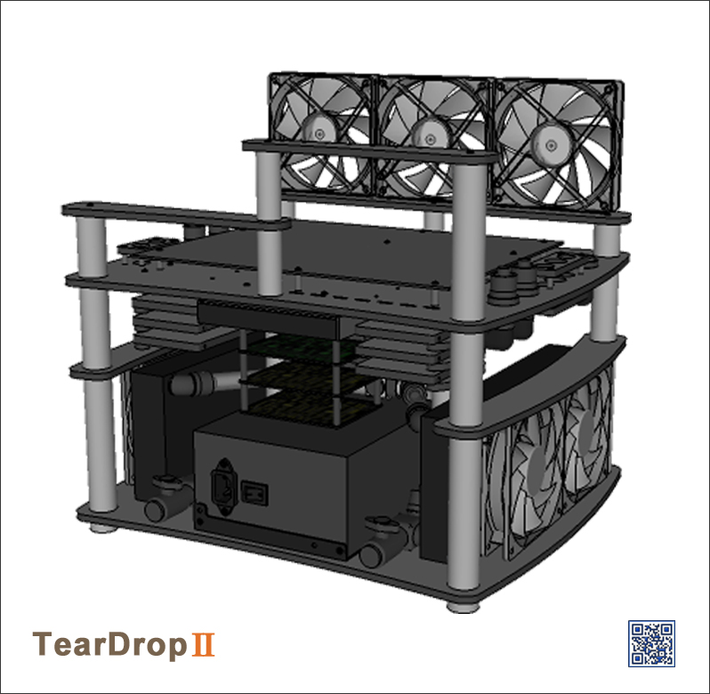

#TearDrop I Fan Controller

##Table of Contents

* [Screenshots](#screenshots)
* [General Description](#general-description)
* [License](#license)

##Screenshots

<table>
	<tr>
		<td align="center" width=25% >
			
		</td>
		<td align="center" width=25% >
			
		</td>
		<td align="center" width=25% >
			
		</td>
		<td align="center" width=25% >
			
		</td>
	</tr>
</table>

##General Description
 
<strong>TearDrop</strong>

This repo contains the following files:

* __arduino__

    The source code for the 2 x ATmega328P that run the Fan Controller 

    The files can can be directly accessed by clicking these links:

    * [Fan Controller: IC1](arduino/TearDrop_Fan_Controller_IC1/TearDrop_Fan_Controller_IC1.ino)

    * [Fan Controller: IC2](arduino/TearDrop_Fan_Controller_IC2/TearDrop_Fan_Controller_IC2.ino)

	The source code requires three supporting open-source [Arduino](http://www.arduino.cc/) libraries.

	For convenience, these libraries are inlcuded here in their own sub-folder.

	Credit goes to:

	    [PinChangeInt](http://playground.arduino.cc/Main/PinChangeInt)

	    [OneWire](https://github.com/ntruchsess/arduino-OneWire/tree/master)

	    [WSWire](https://github.com/steamfire/WSWireLib)

* __eagle__

    This folder contains the complete hardware schematics & PCB design of the Fan Controller.

    __Please do not click on the files in this sub-folder as they are in foramts that 
    are incompatible with Github's hosting server__.

    However, the files can be downloaded and run as usual with [CadSoft](http://www.cadsoftusa.com/?language=en)'s 
    free version of [Eagle](http://www.cadsoftusa.com/download-eagle/freeware/).

* __parts__

	A speadsheet with all information about the parts used for building the Fan Controller.

	__The file in this sub-folder is also in foramts that's incompatible with Github's hosting server__.

    However, the file can be downloaded and run as usual with any spreadsheet editing software.

 
##  License

Released under the <a href="http://www.opensource.org/licenses/MIT">MIT license</a>.

